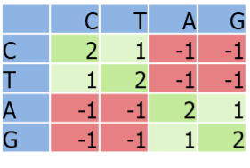
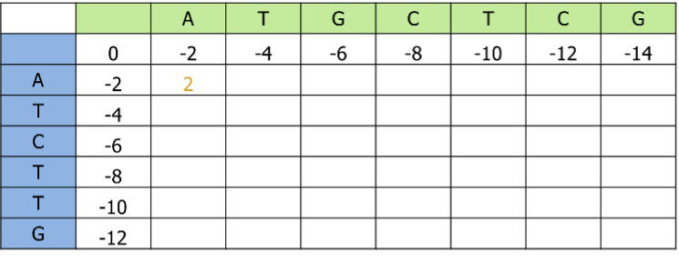

# Practical: Genome alignments
## Overview 
Exercise: Fill out the Needleman-Wunsch algorithm matrix (on a handout)  
Exercise: Make a multi sequence alignment using muscle and mafft
Exercise: Get familiar with the blastn command  
Exercise: Run MLST  
Exercise: Run a core-genome SNP analysis using snippy

## Before you start
All required files for the practicals are deposited in the github repo [github.com/ssi-dk/...](github.com/ssi-dk/...). To get started, clone this repo to your computer.  
```sh
git clone github.com/ssi-dk/...
```
To have the required tools installed on your computer, use `conda` with the provided environment `.yaml` files:
```sh
conda install -c bioconda -c conda-forge -f TBA
conda install -c bioconda -c conda-forge -f TBA
```
Important: Create a subfolder within the repo folder for each tool you are running on the command line, so the output of each tool is in its own folder. 

## Exercise 1: Needleman-Wunsch algorithm
  
Gap penalty = -2
  

## Exercise 2: Multiple Sequence Alignment with mafft and muscle
Use the environment `alignment`  
Align the sequences found in data/16S/16s_sequences.fasta using mafft and muscle from command line
```sh
mafft -h
muscle -h
```

## Exercise 3: blastn
Use blastn to identify the 16s rRNA gene in one of the spades assemblies found in `data/spades_assemblies`  
Use the environment `alignment`  
```sh
blastn -h
```
Use 16s_sequences.fasta as query input and one of the assembly fasta files as subject input

## Exercise 4: MLST

Use the environment `alignment`  

Perform in-silico MLST on all the spades assemblies in `data/spades_assemblies_careful`

Note: You can use `*` to select multiple files or folders for mlst.

## Exercise 5: Core genome alignment and SNP analysis

Use a screen so you can have the job running in the background: 
```sh
screen
cd <your_repo_path>
```

Use the environment `alignment`  
```sh
. activate alignment
```

Run Snippy on the 23 assembly files in `data/spades_assemblies/`

```sh
mkdir snippy
cd snippy
for f in ../data/spades_assemblies/*.fasta; do n=$(basename $f); n=${n/.fasta}; snippy --outdir $n --ctgs ${f}/contigs.fasta --reference  ../data/spades_assemblies/SRR27240806.fasta; done
```
When it's running, you can detach the screen using `Ctrl+A`, followed by `D` to return to your original terminal window.  
To get back into the screen, use `screen -r`  
Note: For running snippy on raw reads (which is much more reliable but takes a bit longer):  
```sh
for f in ../data/illumina_reads/SRR272408*_R1*; do n=$(basename $f); snippy --outdir ${n/_R1*} --R1 $(dirname ${f})/${n} --R2 $(dirname ${f})/${n/_R1*}_R2.fastq.gz --reference ../data/spades_assemblies/SRR27240806.fasta; done
```
When snippy is done, you need to create the core-genome using:  
```sh
snippy-core --ref SRR27240806/ref.fa SRR*/
```


